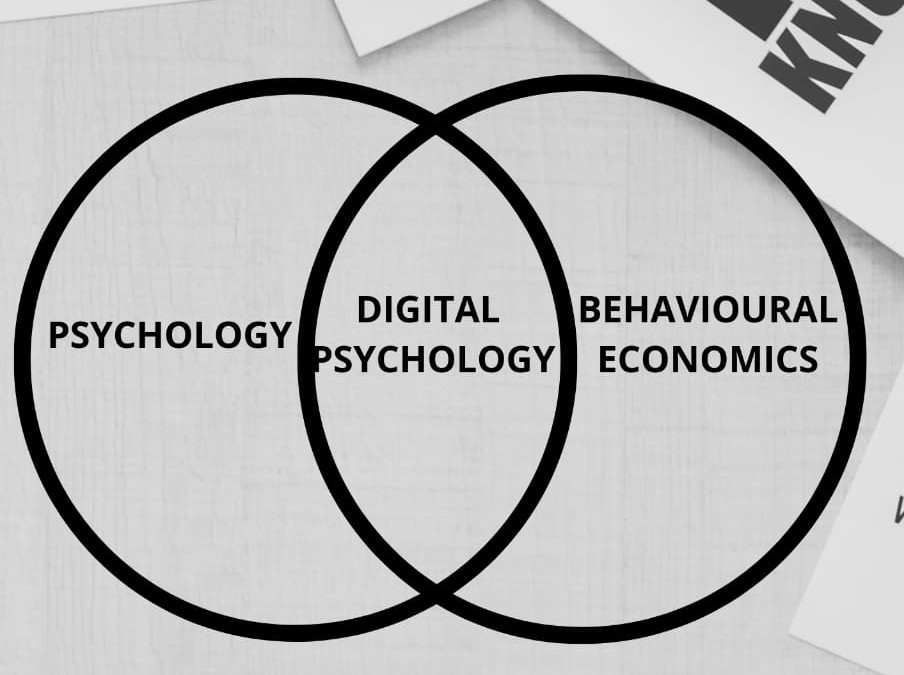
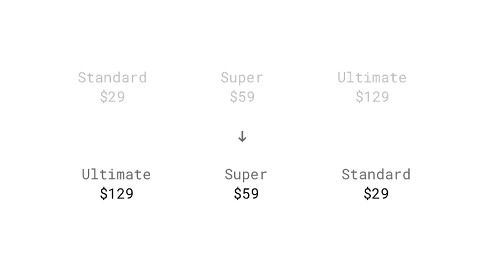
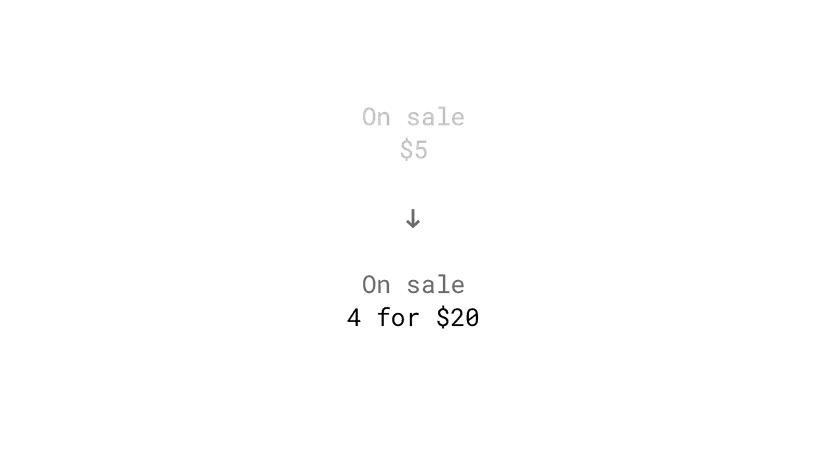

<div align="justify">

## What is Digital Psychology?


Digital psychology is the application of behavioural science principles through interactive media. Research shows that most principles of influence, from person-to-person psychology, also operate from computer-to-person, or between people using technology to mediate and moderate the relation.



The digital psychology approach seeks to understand and explain the ‘why’ behind online user’s activity, rather than the ‘what’ that has traditionally been monitored through tools like Google Analytics. Once a marketer understands the reasons behind their customer’s behaviour, they can begin to implement tools and tactics for influencing them, leading to increases in both customer conversion and retention.

The **metaphor I like to use that best describes this approach** is of a fisherman standing in waders in a river. The river represents technology – always changing, always moving, often so fast we struggle to keep up.  The one constant in this scene is the fisherman, representing the human brain.  As fast as technology may change, the human brain remains the same and has done so for hundreds of thousands of years.  If we start viewing technology through a neurological perspective, rather than trying to influence humanity from a technological perspective, we’re going to be on far firmer, and longer-lasting, ground.

> Digital psychology **isn’t a tactic in itself** – it’s a **way of thinking** that can be applied across the digital marketing mix (and also traditional marketing approaches) at a strategic level.

## Anchoring

Anchoring or focalism is a cognitive bias where an individual depends too heavily on an initial piece of information offered (considered to be the "anchor") when making decisions.

That means, we tend to rely heavily on one piece of information, usually the first one when making a decision or estimating the value of uncertain objects. This initial “anchor” value is used as a mental reference point, which might influence the choice we make.

## Studies

Two groups of high school students were asked by Tversky and Kahneman (1974) to compute, within 5 seconds, the product of the numbers one through eight (1 x 2 x 3…) or the reverse (8 x 7 x 6…). Because of the short time, they had to estimate the product after the first multiplications. These first results gave an anchor for their final answer. The median estimate of the first group was 512, while the median for the descending sequence was 2,250. The correct answer is 40,320.

In a study by Dan Ariely, an audience is first asked to write the last two digits of their social security number and consider whether they would pay this number of dollars for items whose value they did not know, such as wine, chocolate and computer equipment. They were then asked to bid for these items, with the result that the audience members with higher two-digit numbers would submit bids that were between 60 percent and 120 percent higher than those with the lower social security numbers, which had become their anchor.

Judges score better than others on some cognitive illusions like the framing effect (treating economically equivalent gains and losses differently) or representativeness heuristic (ignoring background statistical information in favour of individuating information) but are equally prone to the anchoring effect [(Guthrie, Rachlinski & Wistrich, 2001)](https://papers.ssrn.com/sol3/papers.cfm?abstract_id=257634).

Some people were asked whether Mahatma Gandhi died before or after age 9, or before or after age 140. Clearly, neither of these anchors can be correct, but when the two groups were asked to suggest when they thought he had died, they guessed significantly differently (average age of 50 vs. average age of 67).

Job seekers who anchor first and high in salary negotiations usually get a higher wage. Even a joking comment about an implausible salary could bring the final salary offer up ([Thorsteinson, 2011)](http://onlinelibrary.wiley.com/doi/10.1111/j.1559-1816.2011.00779.x/abstract).

## Examples

### Highest price first

Anchor the price of the most expensive package of your product to the user’s mind by listing it first. This order makes the subsequent plan seem like a bargain.



### Lower price first

Wait, didn’t you just say the opposite? If there is not much of a price difference, try to anchor the lower price. Therefore, the slightly more expensive, but significantly more valuable offer, looks like a steal.


### Listing higher-priced unrelated products

A study showed that exposure to higher prices, even for unrelated products can impact people’s willingness to pay for goods and services [(Nunes & Boatwright, 2004)](https://msbfile03.usc.edu/digitalmeasures/jnunes/intellcont/Incidental%20Prices-1.pdf).


### Exposing users to any high number

Anchoring works with any number, regardless of whether that number is a price [(Adaval & Monroe, 2002)](http://www.jstor.org/stable/10.1086/338212?seq=1#page_scan_tab_contents).


### Multiple-unit pricing

The number of units in a promotion serves as an anchor and indicates which quantity the customer should buy. In an experiment, this tactic increased sales by 32% [(Wansink, Kent & Hoch, 1998)](http://foodpsychology.cornell.edu/sites/default/files/unmanaged_files/Anchoring-JMR-1998.pdf).



### Exposing users to a quantity limit

A study by [Wansink, Kent and Hoch (1998)](http://foodpsychology.cornell.edu/sites/default/files/unmanaged_files/Anchoring-JMR-1998.pdf) evaluated if setting quantity limits affects the shopping behaviour. In the experiment, buyers purchased an average of 3.3 cans of soup when they had no limit, whereas shoppers with a limit of 12 bought an average of 7 cans.


<br>

## Conclusion

Ever heard of the saying, ```You only have one chance to make a first impression``` ?

The above saying can also be taken as an Anchoring Effect. Whenever you meet someone for the first time, they start to form a mental image of you based on their perspective and how you interact. So, make it count!

> The anchoring effect as a powerful impact on the choices we make, from decisions about the things we buy to daily preferences about how to live our lives.

So the next time you are trying to make an important decision, give a little thought to the possible impact of the anchoring bias on your choices. Are you giving enough consideration to all of the available information and all of the possible options, or are you basing your selection on an existing anchor point?

</div>

<br>
<br>
<br>

Until next post... Keep on thinking!

<br>

Author: Ashwin