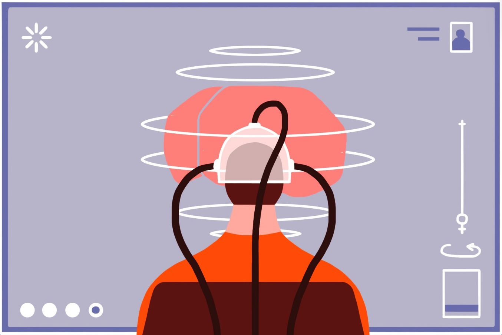

> "I was taught that the human brain was the crowning glory of evolution so far, but I think it's a very poor scheme for survival" - Kurt Vonnegut

Imagine a future where nobody dies instead, our minds are uploaded to a digital world. They might live on in a realistic, simulated environment with avatar bodies, and could still call in and contribute to the biological world. Mind uploading has powerful appeal but what would it actually take to scan a person’s brain and upload their mind?

The main challenges are scanning a brain in enough detail to capture the mind and perfectly recreating that detail artificially. But first, we have to know what to scan. The human brain contains about 86 billion neurons, connected by at least a hundred trillion synapses. The pattern of connectivity among the brain’s neurons, that is, all of the neurons and all their connections to each other, is called the connectome.

We haven’t yet mapped the connectome, and there’s also a lot more to neural signaling. There are hundreds, possibly thousands of different kinds of connections, or synapses. Each functions in a slightly different way. Some work faster, some slower. Some grow or shrink rapidly in the process of learning, some are more stable over time. And beyond the trillions of precise, 1-to-1 connections between neurons, some neurons also spray out neurotransmitters that affect many other neurons at once. All of these different kinds of interactions would need to be mapped in order to copy a person’s mind. There are also a lot of influences on neural signaling that are poorly understood or undiscovered.

To name just one example, patterns of activity between neurons are likely influenced by a type of cell called glia. Glia surround neurons and, according to some scientists, may even outnumber them by as many as ten to one. Glia were once thought to be purely for structural support, and their functions are still poorly understood, but at least some of them can generate their own signals
that influence information processing.

Our understanding of the brain isn’t good enough to determine what we’d need to scan in order to replicate the mind, but assuming our knowledge does advance to that point, how would we scan it?
Currently, we can accurately scan a living human brain with resolutions of about half a millimeter
using our best non-invasive scanning method, MRI. To detect a synapse, we’ll need to scan at a resolution of about a micron — a thousandth of a millimeter.

To distinguish the kind of synapse and precisely how strong each synapse is, we’ll need even better resolution. MRI depends on powerful magnetic fields. Scanning at the resolution required
to determine the details of individual synapses would requires a field strength high enough to cook a person’s tissues. So this kind of leap in resolution would require fundamentally new scanning technology.

It would be more feasible to scan a dead brain using an electron microscope, but even that technology is nowhere near good enough and requires killing the subject first. Assuming we eventually understand the brain well enough to know what to scan and develop the technology to safely scan at that resolution, the next challenge would be to recreate that information digitally.

The main obstacles to doing so are computing power and storage space, both of which are improving every year. We’re actually much closer to attaining this technological capacity than we are to understanding or scanning our own minds. Artificial neural networks already run our internet search engines, digital assistants, self-driving cars, Wall Street trading algorithms, and smart phones.

Nobody has yet built an artificial network with 86 billion neurons, but as computing technology improves, it may be possible to keep track of such massive data sets. At every step in the scanning and uploading process, we’d have to be certain we were capturing all the necessary information accurately or there’s no telling what ruined version of a mind might emerge.

While mind uploading is theoretically possible, we’re likely hundreds of years away from the technology and scientific understanding that would make it a reality. And that reality would come with ethical and philosophical considerations:
- Who would have access to mind uploading?
- What rights would be accorded to uploaded minds?
- How could this technology be abused?

Even if we can eventually upload our minds, whether we should remains an open question.

 
 

Author: Ashwin