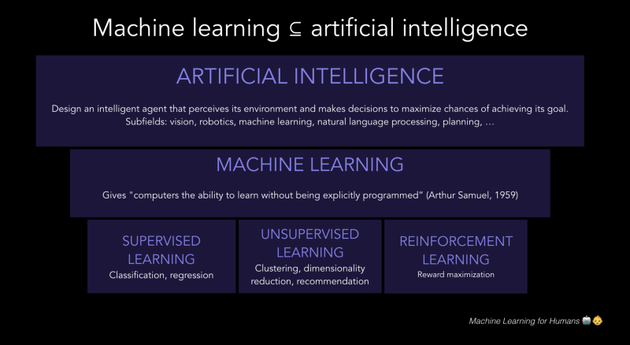

In my opinion, most Machine Learning tutorials aren’t beginner-friendly enough.

**This post is intended for complete beginners and assumes ZERO prior knowledge of machine learning.** We’ll learn what Machine Learning is and how they work from the ground up.

Ready? Let’s dive in.

## Introduction to ML

Arthur Samuel described machine learning as: "The field of study that gives computers the ability to learn without being explicitly programmed.' This is an older, informal definition which now holds little meaning.

Tom Mitchell provides a more modern definition: "A computer program is said to learn from experience E with respect to some class of tasks T and performance measure P, if its performance at tasks in T, as measured by P, improves with experience E." We need more conceptual understanding to comprehend what this means (Let's come back to this at a later time)

> Machine learning is a method of data analysis that automates analytical model building.

In simpler terms, Machine learning focuses on the development of computer programs that can access data and use it learn for themselves, and later improve from experience without being explicitly programmed. The primary aim is to allow the computers learn automatically without human intervention or assistance and adjust actions accordingly.

So, basically a machine’s learning algorithm enables it to identify patterns in observed data, build models that explain the world, and predict things without having explicit pre-programmed rules and models.

**How Does Process of Learning Begin?**

The process of learning begins with feeding/providing data, giving instructions in order to look for patterns/observations in the data and later make decisions in the future on new data that we provide.

The machine "learns" by using old/past data to get information about the likeliest event that will happen. If the old data looks a lot like the new data, then the things you can say about the old data will probably be relevant to the new data. It’s like **looking back to look forward** (Something like Back to the Future 😉).

## Application of ML in Real Scenarios

 - Machine learning algorithms are probably behind some of online retailers. Companies such as Amazon use this technology to offer a highly-personalized services and recommendations. Machine learning allows retailers to offer you personalized recommendations based on your previous purchases or activity.
 - Voice recognition systems such as Google Assistant, Siri and Cortana use machine learning to imitate human interaction.
 - Google Maps analyzes speed of traffic through anonymous location data from smartphones .This enables us to reduce travel time by getting suggestions of faster routes.
 - Some search engines offer recommendations based on previous search results, which is also a usecase of machine learning.

And so much more...

## Types of ML Algorithms

Machine Learning Algorithms can be divided into three:
 - Supervised Learning (Task Driven)
 - Unsupervised Learning (Data Driven)
 - Reinforcement Learning (Learning from Environment)

  

Woah! You might be wondering what are all these terms? Let me explain these in simple terms.

### Supervised Learning

Consider you have an input _x_ and output _y_, Supervised learning is where an algorithm is used to learn the mapping between the variables _x_ and _y_ represented as a function _y = f(x)_.

The goal of supervised learning is that when there is a new data _x_, then this mapping function can be used to predict the output _y_.

It is called supervised learning because the process of learning can be thought of as an analogy to a teacher supervising the learning process of students.

### Unsupervised Learning

Unsupervised learning is when you only have input _x_ and no corresponding output variables.

The goal of unsupervised learning is to construct the underlying structure or distribution in the input in order to learn more about it.

It is called unsupervised learning because unlike supervised learning, there are no correct methods of solving a problem or no teachers to supervise. Algorithms learn about the input themselves and present the interesting structure in the input in the best possible way.

### Reinforcement Learning

Reinforcement learning is all about making decisions sequentially. In simple words we can say that the output depends on the state of the current input and the next input depends on the output of the previous input.

It is about taking suitable action to maximize reward in a particular situation. Though both supervised and reinforcement learning use mapping between input and output, reinforcement learning uses rewards and punishment as signals for positive and negative behavior.

As compared to unsupervised learning, reinforcement learning is different in terms of goals. While the goal in unsupervised learning is to find similarities and differences between data points, in reinforcement learning the goal is to find a suitable action model that would maximize the total cumulative reward of the agent in the long-term.

## Where to begin with Machine Learning

 - First thigs first, learn (and/or) revise linear algebra. MIT has provided an amazing [open course](https://ocw.mit.edu/courses/mathematics/18-06-linear-algebra-spring-2010/video-lectures) on linear algebra. This should introduce you to all the core concepts of linear algebra, and you should pay particular attention to vectors, matrix multiplication, determinants, and Eigenvector decomposition — all of which play an important role in the working of ML algorithms.
 - After that, calculus should be your next focus. Here you should be most interested in learning and understanding the meaning of derivatives, and how we can use them for optimization. You should make sure to get through all topics in [Single Variable Calculus](https://ocw.mit.edu/courses/mathematics/18-01-single-variable-calculus-fall-2006/video-lectures) and atleast first two sections of [Multivariable Calculus](https://ocw.mit.edu/courses/mathematics/18-02sc-multivariable-calculus-fall-2010/index.htm).
 - Get thorough with Python libraries used in Machine Learning, mainly Numpy, Pandas, Matplotlib and SKLearn. Machine learning without all these, what I like to call ‘Tools’ would be quite tough.
 - Get coding! It’s always a good practice to implement all algorithms from scratch in Python before using the premade models in SciKit-Learn, as it gives you a better and in-depth knowledge of how it works. You can start with these in no particular order:
    - Linear Regression
    - Logistic Regression
    - Naive Bayes Classifier
    - K-Nearest Neighbors (KNN)
    - K-Means Clustering
    - Support Vector Machine (SVM)
    - Decision Trees
    - Random Forests
    - Gradient Boosting

## Algorithm Implementation Roadmap

 - **Get data to work on** : There are millions of data sets available on the internet, catering to even the weirdest of your needs. [Kaggle](https://www.kaggle.com/datasets) and [UCI](https://archive.ics.uci.edu/ml/datasets.html) are great resources to look out for data sets. One can also generate her/his own dataset for some algorithm implementations.
 - **Choosing an algorithm(s)** : Once you have the data in a good place to work with it, you can start trying different algorithms. The image below is a rough guide. (From SKLearn’s documentation)

  

At this stage, I recommend you to go through the short theory of each algorithm that I'm planning to upload to my [Github](https://github.com/Ashwin-op) with each implementation.

 - **Visualise the data** : Python has various libraries such as Matplotlib and Seaborn that help us plot the data, and also get a better intuition of the data and what to do. Use them to explore your data.
 - **Tune the algorithm** : All the models that we implement, have tons of buttons and knobs to play around with, better known as hyper-parameters. The learning rate, the k value, etc. all can be changed to get the best possible model.
 - **Evaluate the model** : The Python library, SKLearn, provides a lot of tools to evaluate your model and check for metrics such as accuracy, precision, etc.

## Conclusion

Once you get familiar with a few algorithms and concepts, jump into one short term project(s) that isn’t super complex (to begin with). Don’t be afraid to fail. The majority of your time, in the beginning, will be spent trying to figure out the math, or how and why an error popped up. But, tenacity is key. These small models are a sandbox for learning a lot by failing — so make use of it and give everything a try, even if it doesn’t really make sense to someone else. If it makes sense to you, it might turn out to be the best fit model.

The best way to go around Python libraries is either through Datacamp courses or directly through their official documentation. If you really wish to dive deep into machine learning then I would recommend you to start with Andrew Ng's [Machine Learning Course](https://www.coursera.org/learn/machine-learning) on Coursera (or) CS-229 [course](http://cs229.stanford.edu/) by Stanford University.

Happy Learning!