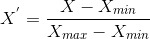
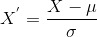

In the [last post](https://the-minimalist.now.sh/An-introduction-to-Machine-Learning) on Machine Learning, we went through the basics of ML, some references to study and other things related to ML. In this series, We'll be travelling together through different topics in and around ML (without losing our sanity, I hope!) and by the time this is over, we'll get a good grip on what exactly machine learning is. A little Python knowledge may be required but other than that nothing is assumed. So, buckle up and let's start!


## Introduction

We’re starting with data preprocessing because this plays a crucial step in the journey of making a machine learning model. If there is no data preprocessing then, your machine learning model won’t work properly. This is like before you start a long journey you prepare food, pack your clothes, take necessary items, book flights, etc. But even though this might be the most boring part of the trip, once everything is arranged/packed you will have an awesome time during your journey. The same applies to our machine learning journey.


## Get the Dataset

The dataset and the corresponding codes are in my [GitHub](https://github.com/Ashwin-op/Machine-Learning-Series). The datasets that we’ll be using are in the form of a *.csv (Comma Separated Values) file type. What it means is, the values that are in the file are separated by commas.


## Required Libraries

With the data in hand, we are ready to start the data preprocessing steps and the first step you should know is how to import libraries that we need.

> A library is a tool that you can use to do a particular job. More formally, it’s a collection of functions in a single package that can simplify your code.

We are going to use many libraries as we go through this series, but the three most which we’ll be using are `Numpy`, `Pandas` and `matplotlib`.

### NumPy

It stands for “Numerical Python”. [Numpy](http://www.numpy.org/) is the core library for scientific computing in Python. It is a general-purpose array-processing package. NumPy arrays can also be used as an efficient multi-dimensional container for generic data.

### Pandas

[Pandas](http://pandas.pydata.org/) is a fast, powerful, flexible and easy to use open-source data analysis and manipulation tool. It is built on the Numpy package.

### Matplotlib

[Matplotlib](https://matplotlib.org/) is a comprehensive library for creating static, animated, and interactive visualizations in Python. It is a multi-platform data visualization library built on NumPy arrays.

### Importing Libraries

To import these libraries,
```py
import numpy as np
import pandas as pd
import matplotlib.pyplot as plt
```
We can just type `import numpy`, but to simplify our codes and make it easier to type longer codes we use abbreviations.


## Importing the Dataset

The best library to import the data set is the pandas library, so we’re going to import the dataset using pandas. We’ll declare a new variable and import using `pd.read_csv()`,
```py
dataset = pd.read_csv('Data.csv')
```
If you print this imported `dataset`, it will look something like this,
```
Id Country   Age   Salary Purchased
0   France  44.0  72000.0        No
1    Spain  27.0  48000.0       Yes
2  Germany  30.0  54000.0        No
3    Spain  38.0  61000.0        No
4  Germany  40.0      NaN       Yes
5   France  35.0  58000.0       Yes
6    Spain   NaN  52000.0        No
7   France  48.0  79000.0       Yes
8  Germany  50.0  83000.0        No
9   France  37.0  67000.0       Yes
```
Now, this is called a DataFrame. It’s a two-dimensional data structure, i.e., data is aligned in a tabular fashion in rows and columns. You can think of it like a spreadsheet or a SQL table. Remember it like this,

> Pandas DataFrame is nothing but an in-memory representation of an excel sheet via Python programming language.

### Dependence & Independence

The dataset has 5 columns:
- The first column is the `index` assigned by `pandas` to our dataset.
- The second column is the `country` with the country names.
- The third column is the `age` in years.
- The fourth column is the `salary` in (insert some currency unit).
- The fifth column is `purchased`, whether yes/no.

The columns are called attributes/features of the data and are mostly split into two, the independent attributes and the dependent attributes. The independent attributes are the ones which don’t depend on any other attributes, while the dependent attributes depend on the independent attributes mentioned before.

In our case, the independent attributes are `country`, `age` and `salary`. The dependent attribute is `purchased`. We transfer the dependent attributes to a variable called `X` and the independent attributes to a variable called `y`.
```py
X = dataset.iloc[:, :-1].values
y = dataset.iloc[:, -1].values
```
To understand what is `iloc`, we need to understand what are Pandas Series.

### Pandas Data Structures

The data structure provided by Pandas are of two types:
- Pandas DataFrame
- Pandas Series

The pandas series is nothing but a single column of the pandas DataFrame. In other words, A Pandas DataFrame is a collection of Pandas Series. It is a one-dimensional labelled array capable of holding any data type (integers, strings, floating-point numbers, Python objects, etc.).

Now back to our initial question, what is `iloc`?

To put in simple terms, iloc is an operation for retrieving data from Pandas DataFrame. The iloc indexer for Pandas Dataframe is used for integer-location based indexing/selection by position. There are two “arguments” to iloc, a row selector, and a column selector.

The syntax is `iloc[<row_selector>, <column_selector>]`.

> Note that `iloc` returns a Pandas Series when one row is selected, and a Pandas DataFrame when multiple rows are selected, or if any column in full is selected.

In our code, the first `:` means, we select all rows and the second `:-1` means, we select all columns except the last (this is similar to list slicing). The `values` just tell the `iloc` to return the values of the selected rows & columns.


## Missing Data

Now that our dataset is imported and we’ve prepared it, we come across our next problem and that is “The case of the missing data”. We have to deal with the case that our dataset might contain missing data and that happens quite a lot actually in real life. So, you have to get the knack of handling this problem and make it all good for your machine learning model to run correctly.

In our dataset, we can see there are two missing data, one in the `age` column and the other in the `salary` column (represented by `NaN`). Since this is a small dataset we can see and tell if there is missing data, but that’s not possible if we have a dataset of size in the tens of thousands (We’ll come back to that later).

Your first idea to handle this problem would be to remove those lines of data where there is some missing information, but that would be dangerous if the dataset had some important/crucial information. So how do we handle this then?

Another most common idea to handle missing data is if the missing data is a number then replace the missing data with the mean of the column. So that’s the strategy we’re gonna use.

We’re not going to manually calculate the mean and replace, instead, we’re going to take the help of the scikit’s impute library. The `SimpleImputer` class in scikit’s impute library provides basic strategies for imputing missing values. Missing values can be imputed with a provided constant value, or using the statistics (mean, median or most frequent) of each column in which the missing values are located.

First, we import the required library,
```py
from sklearn.impute import SimpleImputer
```
Then, we create an object for `SimpleImputer` and initially fit and subsequently transform for the required columns in `X`.
```py
si = SimpleImputer(missing_values=np.nan, strategy='mean')
si.fit(X[:, 1:3])
X[:, 1:3] = si.transform(X[:, 1:3])
```
What we do with the above lines of code is that we create an object `si` for the `SimpleImputer` class and give the parameter `missing_values` as `np.nan` which is nothing but `NaN` in our dataset. The strategy to fill the `NaN` is given as `mean`. We first fit (which is a method) the Imputer to our required data and then transform (which is also a method) it to our independent variable `X`.

After doing the above, `X` will look like,
```py
[['France' 44.0 72000.0]
 ['Spain' 27.0 48000.0]
 ['Germany' 30.0 54000.0]
 ['Spain' 38.0 61000.0]
 ['Germany' 40.0 63777.77777777778]
 ['France' 35.0 58000.0]
 ['Spain' 38.77777777777778 52000.0]
 ['France' 48.0 79000.0]
 ['Germany' 50.0 83000.0]
 ['France' 37.0 67000.0]]
```

### A detailed explanation of some terms mentioned above

A class is the model of something we want to build. For example, if we make a house construction plan that gathers the instructions on how to build a house, then this construction plan is the class.

An object is an instance of the class. So if we take that same example of the house construction plan, then an object is simply a house. A house (the object) that was built by following the instructions of the construction plan (the class) and therefore there can be many objects of the same class because we can build many houses from the construction plan.

A method is a tool we can use on the object to complete a specific action. So in this same example, a tool can be to open the main door of the house if a guest is coming. A method can also be seen as a function that is applied to the object, takes some inputs (that were defined in the class) and returns some output.

You use an Imputer to handle missing data in your dataset. Imputer gives you easy methods to replace NaNs and blanks with something like the mean of the column or even median.

But before it can replace these values, it has to calculate the value that will be used to replace blanks. If you tell the Imputer that you want the mean of all the values in the column to be used to replace all the NaNs in that column, the Imputer has to calculate the mean first. This step of calculating that value is called the `fit()` method.

Next, the `transform()` method will just replace the NaNs in the column with the newly calculated value and return the new dataset. That’s pretty simple. The `fit_transform()` method will do both the things internally and makes it easy for us by just exposing one single method. But there are instances where you want to call only the `fit()` method and only the `transform()` method.


## Categorical Data

These are attributes/features that can be split into categories based on their values. For example, in our dataset, the `country` is a categorical value because it can have France, Spain or Germany as it’s value. Similarly, `purchased` is also a categorical value.

Since machine learning models are based on mathematical equations, you can intuitively understand that keeping test/string as values can have problems as we want only numbers in the equations. That’s why we need to encode the categorical features i.e., encode the text into numbers.

So as usual, we’re going to import a library to do the job for us.
```py
from sklearn.preprocessing import LabelEncoder
```
Then we create an object for the class `LabelEncoder` and `fit_transform()` that to our required columns in `X`.
```py
le = LabelEncoder()
X[:, 0] = le.fit_transform(X[:, 0])
```
When we do the above and look at `X`,
```py
[[0 44.0 72000.0]
 [2 27.0 48000.0]
 [1 30.0 54000.0]
 [2 38.0 61000.0]
 [1 40.0 63777.77777777778]
 [0 35.0 58000.0]
 [2 38.77777777777778 52000.0]
 [0 48.0 79000.0]
 [1 50.0 83000.0]
 [0 37.0 67000.0]]
```
This will cause errors in our machine learning models, can you think of the reason?

Since the machine learning models are mathematical equations, it will be forced to think that Germany > Spain (because 1 > 0), which we don’t want.

So, what we’ll do is, create three columns, one for each of Spain, France and Germany and put the value ‘1’ in them corresponding to our data in `X`. For this, we need two classes called `OneHotEncoder` and `ColumnTransformer`,
```py
from sklearn.preprocessing import OneHotEncoder
from sklearn.compose import ColumnTransformer
```
Here, it’s a little different than before. We first create an object for the `ColumnTransformer` class and using `OneHotEncoder` we pass the column that needs to be encoded (The `country` column). By specifying `remainder='passthrough'`, all remaining columns that were not specified before will be automatically passed through. This subset of columns is concatenated with the output of the things selected for encoding. We then `fit_transform()` the whole of `X` and convert it into an array using `numpy`.
```py
ct = ColumnTransformer([('encoder', OneHotEncoder(), [0])],
                       remainder='passthrough')
X = np.array(ct.fit_transform(X))
```
After this, if we look at `X`,
```py
[[1.0 0.0 0.0 44.0 72000.0]
 [0.0 0.0 1.0 27.0 48000.0]
 [0.0 1.0 0.0 30.0 54000.0]
 [0.0 0.0 1.0 38.0 61000.0]
 [0.0 1.0 0.0 40.0 63777.77777777778]
 [1.0 0.0 0.0 35.0 58000.0]
 [0.0 0.0 1.0 38.77777777777778 52000.0]
 [1.0 0.0 0.0 48.0 79000.0]
 [0.0 1.0 0.0 50.0 83000.0]
 [1.0 0.0 0.0 37.0 67000.0]]
```
As you can see, there are three columns one for each country.

Next, we encode the purchased attribute using the `LabelEncoder`, we don’t need `OneHotEncoder` here because there are only two classes of the `purchased` variable.
```py
y = LabelEncoder().fit_transform(y)
```


## Feature Scaling

It is a step of Data Preprocessing which is applied to independent attributes or features of data. It basically helps to normalise the data within a particular range. Sometimes, it also helps in speeding up the calculations in an algorithm.

One of the first things that you will notice in our dataset is that the magnitude and range of different features varies a lot. For example, in our dataset, the `age` feature is not in the same range as the `salary` feature.

Most machine learning algorithms take into account only the magnitude of the measurements, not the units of those measurements. That’s why one feature, which is expressed in a very high magnitude (number), may affect the model a lot more than an equally important feature.

The two main techniques to do this are:
- Standardization
- Normalization

### Normalization

Normalization is a scaling technique in which values are shifted and rescaled so that they end up ranging between 0 and 1. It is also known as Min-Max scaling.

<div className="Image__Small">
  
</div>

Here, Xₘₐₓ and Xₘᵢₙ are the maximum and the minimum values of the feature respectively.
- When the value of X is the minimum value in the column, the numerator will be 0, and hence X’ is 0.
- On the other hand, when the value of X is the maximum value in the column, the numerator is equal to the denominator and thus the value of X’ is 1.
- If the value of X is between the minimum and the maximum value, then the value of X’ is between 0 and 1.

### Standardization

Standardization is another scaling technique where the values are centred around the mean with a unit standard deviation. This means that the mean of the attribute becomes zero and the resultant distribution has a unit standard deviation.

<div className="Image__Small">
  
</div>

Here, μ is the mean of the feature values and σ is the standard deviation of the feature values. Note that in this case, the values are not restricted to a particular range.

### Which to use?

Normalization vs. standardization is an eternal question among machine learning newcomers. Let me elaborate.
- Normalization is good to use when you know that the distribution of your data does not follow a Gaussian distribution. This can be useful in algorithms that do not assume any distribution of the data.
- Standardization, on the other hand, can be helpful in cases where the data follows a Gaussian distribution. However, this does not have to be necessarily true. Also, unlike normalization, standardization does not have a bounding range. So, even if you have outliers in your data, they will not be affected by standardization.

However, at the end of the day, the choice of using normalization or standardization will depend on your problem and the machine learning algorithm you are using. There is no hard and fast rule to tell you when to normalize or standardize your data. You can always start by fitting your model to raw, normalized and standardized data and compare the performance for best results.

As usual, we import the required library,
```py
from sklearn.preprocessing import StandardScaler
```
Similar to before, we create an object for `StandardScaler` and `fit_transform()` it to `X`.
```py
sc = StandardScaler()
X = sc.fit_transform(X)
```


## Splitting the Dataset

Now we’re going to see how to split our dataset into a training set and a testing set. But why do we need to do it?

Well, when you take a step back and focus on the word ‘Machine Learning’, you would understand that this is about a machine that’s going to learn something. Here, it’s your algorithm/model that’s going to learn from your data to make predictions or other machine learning goals.

So your machine learning model is going to learn to do something on your dataset by understanding some correlations that are present in your dataset. Imagine if your machine learning model learnt too much from the data that it’s unable to draw out required correlations from the dataset, then the reliability of your machine learning model comes down.

So, as usual, we import another library to simplify our lives. It is going to be the train_test_split from sklearn’s model selection.
```py
from sklearn.model_selection import train_test_split
```
What `train_test_split` does is it splits arrays or matrices into a random train and test subsets (which is exactly what we need).
So, here we have two input sets that we need to split, the independent features contained in `X` and the dependent variable contained in `y`.
```py
X_train, X_test, y_train, y_test = train_test_split(X, y, test_size = 0.2,
                                                    random_state = 0)
```
What the `test_size` parameter tells is that the size of the test set should be 20% of the total size of the inputs (Here, `X` and `y` have the same number of rows). The `random_state` parameter is the seed used by the random number generator.


## Conclusion

Phew! So finally we have completed one of the most boring parts of this journey. In this post, we saw how to shape our data to our requirements and I’m very excited to get started with Regression in the next post.

I’m gone, ~Poof~!